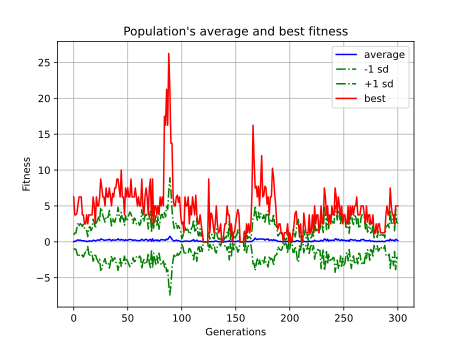
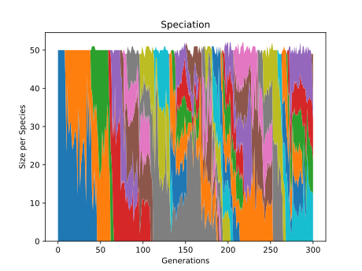

# NeuroEvolution of Augmenting Topologies Chess Engine
This project is training a value network for Monte Carlo Tree Search (MCTS) via the
NeuroEvolution of Augmenting Topologies algorithm. Aside from the chess AI, a chess
rules manager and a chess GUI have been implemented using Python. The following videos
give an overview of the training process:

## NEAT Training of Neuroevolutionary Chess Engine

## NeuroEvolution of Best Genome

